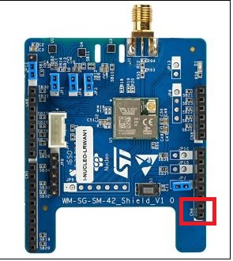
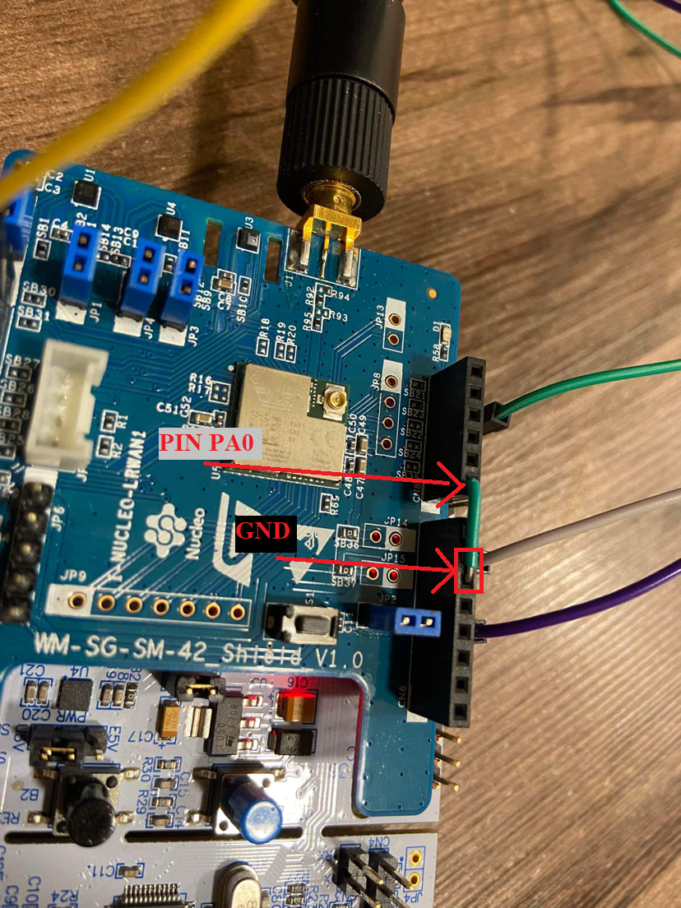
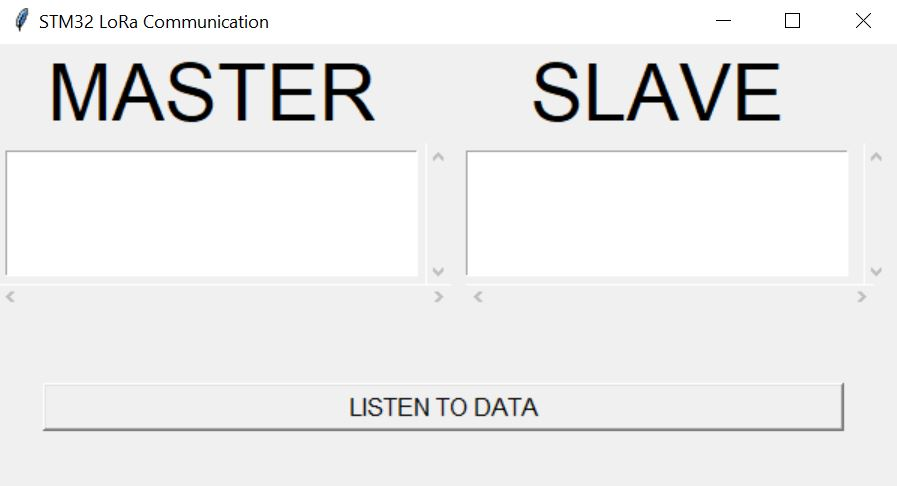

# STM32 LoraWan

Embedded Systems IOT project that utilizes STM32 L152 Nucleo and USI STM32 to create a two-way LoRa message exchange.

Developed for IOT: Internet of Things course @ WUT Warsaw University of
Technology.

Visit the [Wiki](https://github.com/pmielech/stm32-lorawan/wiki) to read more
about the project.

# Features

- BME280 Sensor to read surrounding's general temperature and pressure
- [SEN0193](https://wiki.dfrobot.com/Capacitive_Soil_Moisture_Sensor_SKU_SEN0193) Sensor to measure soil moisture levels
- Request to measuring SLAVE is sent only when button on MASTER board is pressed,
- Choice of master or slave depend on PA0 Pin on STM32 Board

# Built with

- STM32 L152 Nucleo-64 development board,
- USI STM32 Nucleo expansion board for LoRa,
- BME280 I2C/SPI breakout board,
- SEN0193 breakout board,
- LCD display

# File structure:

```
|
|-- src
|   |
|   |- config.h
|   |- pinout.h
|   |- ADC.h
|   |- ADC.cpp
|   |- main.h
|   |- main.cpp
|   |- lora.h (interfacing with LoRa WAN Shield)
|   |- lora.cpp
|   |- bme280_sensor.h (interfacing, using Adafruit BME280 sensor)
|   |- bme280_sensor.cpp
|
|- LICENSE
|- platformio.ini
|- README.md --> This file
```
## Hardware connection
To ensure proper communication between the STM32 and the LoRa Wan shield, it is necessary to connect the marked pins on the LoRa Wan Shield to the corresponding pins on the STM32 board. First Pin marked on the diagram should be connected to PA9, and the second pin marked on the diagram should be connected to PA10. Below is the diagram with marked pins.

<p align="center">
  
</p>

BME280 sensor - connect SDA pin to PB7, SCL pin to PB6, Vcc to 3.3 V and GND

SEN0193 sensor - connect to Converter ADC, Analog Pin to Pin ADC/PC_2, Vcc to 3.3V and GND

Choice of Master or slave:
  Pin PA0 to GND - STM32 board work as Master
  Pin PA0 PULLUP - STM32 board work as Slave
<p align="center">
  
</p>

## Application

In the "application" folder is an application for monitoring the serial port. During the operation of the application, the STM32 boards communicating with each other must be connected to the computer. Initially, it is necessary to select the COM port on which the slave and master are located. Next user should press the "Listen to data" button, we can watch transmit measurements from sensors between the devices. Below are screenshots of the application.

<p align="center">
  
</p>

<p align="center">
  
</p>

## LCD Display
MASTER - The LCD screen displays information about sending an request and confirmation a response from SLAVE <br>
SLAVE - The LCD screen displays confirmation an request from MASTER

## Future development note

- [Issue] Debugging with current PlatformIO configuration don't work properly
- [Issue] Sending larger number of bytes

## Useful links

1. For more information on how to use ST I-NUCLEO-LRWAN1 Shield with Arduino framework for STM32 look into the original [stm32iduino GitHub page](https://github.com/stm32duino/I-NUCLEO-LRWAN1).
2. For more information on how to use ST I-NUCLEO-LRWAN1 Shield with STM32 Cube IDE and HAL libraries look into the [ST website](https://www.st.com/en/evaluation-tools/i-nucleo-lrwan1.html) and into the [original GitHub page](https://github.com/USIWP1Module/USI_I-NUCLEO-LRWAN1).
